# Architecture and Flow Diagrams

This document provides comprehensive flow diagrams showing how all components of the Formly Agents system are connected and interact with each other.

## Table of Contents

1. [Project Overview and Motivation](#project-overview-and-motivation)
   - What is Formly Agents?
   - Core Motivation
   - Business Value Proposition
   - The Problem We're Solving
   - Our Solution
   - Key Use Cases
   - The Technology Stack
   - Why This Matters
   - Project Goals
   - How It Works (High-Level)
   - Key Innovations
   - Future Vision
2. [System Overview](#system-overview)
3. [Component Architecture](#component-architecture)
4. [Agent Workflow](#agent-workflow)
5. [Data Flow](#data-flow)
6. [Integration Flow](#integration-flow)
7. [Section Integration](#section-integration)
8. [Detailed Agent Execution Flow](#detailed-agent-execution-flow)
9. [Component Dependencies](#component-dependencies)
10. [Data Flow for Document Creation](#data-flow-for-document-creation)
11. [Evaluation Flow](#evaluation-flow)
12. [Knowledge Retrieval Flow](#knowledge-retrieval-flow)
13. [RAG Pipeline Flow](#rag-pipeline-flow)
14. [Project Impact and Benefits](#project-impact-and-benefits)
15. [Summary](#summary)

---

## Project Overview and Motivation

### What is Formly Agents?

**Formly Agents** is an AI-powered system designed to automate the creation of regulatory documentation for medical devices. The system uses advanced AI agents powered by LangGraph and LangChain to assist consultants and regulatory professionals in preparing FDA submissions, specifically 510(k) premarket notifications.

### Core Motivation

The medical device regulatory industry faces significant challenges:

1. **Time-Intensive Process**: Preparing FDA 510(k) submissions typically takes 2-4 weeks of dedicated consultant time
2. **Knowledge Overload**: Consultants must navigate 300,000+ FDA documents to find similar devices
3. **Error-Prone**: Manual documentation leads to inconsistencies and errors that delay approvals
4. **Knowledge Silos**: Client-specific information (from conversations, meetings) is often lost or not integrated
5. **Lack of Automation**: Most processes are manual, copy-paste operations with little automation
6. **Risk of Mistakes**: Errors in regulatory documents can lead to rejection, delays, or even safety issues

**Formly Agents** was created to solve these challenges by providing an intelligent, automated system that:
- Reduces documentation time by 70-90%
- Ensures consistency and accuracy across all documents
- Leverages AI to search and understand regulatory documents
- Integrates both global knowledge and client-specific information
- Provides safety mechanisms (rollback, evaluation) to prevent mistakes
- Maintains complete audit trails for compliance

### Business Value Proposition

#### For Regulatory Consulting Firms
- **Increased Productivity**: Consultants can handle 3-5x more clients with the same resources
- **Higher Quality**: Automated consistency checks reduce errors and improve submission quality
- **Competitive Advantage**: Faster turnaround times and higher success rates
- **Knowledge Assets**: Captures and reuses institutional knowledge
- **Scalability**: Can scale operations without proportionally increasing headcount

#### For Medical Device Companies
- **Faster Time-to-Market**: Reduced documentation time means faster FDA approval
- **Cost Savings**: Lower consulting fees due to reduced time requirements
- **Risk Reduction**: Lower risk of rejection due to errors or inconsistencies
- **Compliance Confidence**: Automated checks ensure compliance with FDA requirements
- **Transparency**: Complete audit trail provides visibility into the process

#### For the Healthcare Ecosystem
- **Patient Safety**: Faster approval of safe medical devices improves patient outcomes
- **Innovation**: Enables smaller companies to navigate regulatory processes
- **Standardization**: Promotes best practices across the industry
- **Accessibility**: Makes regulatory expertise more accessible to all companies

### The Problem We're Solving

Creating regulatory documentation for medical devices is a complex, time-consuming, and error-prone process that requires:

1. **Extensive Research**: Finding similar devices from hundreds of thousands of FDA 510(k) summaries
2. **Knowledge Management**: Keeping track of both global regulatory guidelines and client-specific information
3. **Document Creation**: Writing multiple interconnected documents (regulatory requirements, clinical summaries, risk analyses, etc.)
4. **Compliance**: Ensuring all documents meet FDA requirements and are consistent with each other
5. **Safety**: Preventing mistakes that could affect production data or regulatory submissions

Traditional approaches involve:
- Manual research through FDA databases
- Copy-pasting information across documents
- Risk of inconsistencies and errors
- Time-consuming repetitive tasks
- Difficulty tracking changes and maintaining audit trails

### Our Solution

Formly Agents addresses these challenges through:

#### 🤖 **Intelligent Automation**
- **Multi-Document Agent**: Creates 10+ interconnected regulatory documents automatically
- **Research Automation**: Automatically searches through 300,000+ FDA 510(k) documents to find similar devices
- **Knowledge Integration**: Combines global regulatory knowledge with client-specific information
- **Context Management**: Maintains consistency across all documents while preventing information loss

#### 🔒 **Safety and Reliability**
- **Rollback System**: All changes are tracked and can be undone if mistakes are detected
- **Safe Evaluation**: Test agents extensively without affecting production data
- **Transaction Tracking**: Complete audit trail of all actions
- **Error Recovery**: Ability to rollback changes when errors are identified

#### 📊 **Advanced Retrieval**
- **Hybrid Search**: Combines semantic understanding (AI) with exact keyword matching for better results
- **Knowledge Stores**: Separate stores for global guidelines and client-specific information
- **Conflict Detection**: Identifies and resolves contradictory information
- **Recency Scoring**: Prioritizes newer, more relevant information

#### 🧠 **Context Management**
- **Context Segmentation**: Organizes information by topic to prevent confusion
- **Smart Compression**: Compresses context intelligently based on relevance, not just length
- **Checkpointing**: Saves state at critical points for recovery
- **Drift Prevention**: Prevents the agent from losing focus or making inconsistent decisions

### Key Use Cases

#### 1. **FDA 510(k) Submission Preparation**
A consultant needs to prepare a 510(k) submission for a new blood glucose monitor. The agent:
- Searches through 300,000+ FDA documents to find similar devices
- Retrieves relevant regulatory requirements and guidelines
- Creates all required documents (regulatory, clinical, risk analysis, etc.)
- Ensures consistency across all documents
- Tracks all changes for audit purposes

#### 2. **Client-Specific Knowledge Integration**
A consultant has a client working on a pacemaker. The agent:
- Retrieves global FDA guidelines for implantable devices
- Incorporates client-specific information from conversations (e.g., "clinical trial starting early 2026")
- Creates documents that are both compliant and tailored to the client
- Maintains consistency with previous client communications

#### 3. **Safe Testing and Evaluation**
Before deploying to production, the agent:
- Runs extensive evaluations using mock APIs
- Tests different scenarios without affecting production data
- Measures performance on completeness, correctness, and safety
- Allows safe iteration and improvement

### The Technology Stack

- **LangGraph**: Orchestrates the multi-phase agent workflow
- **LangChain**: Provides the agent framework and tool integration
- **LangSmith**: Enables evaluation, monitoring, and tracing
- **OpenAI**: Powers embeddings and language model capabilities
- **Qdrant**: Vector database for efficient similarity search
- **BM25**: Keyword-based retrieval for exact matches

### Why This Matters

#### The Regulatory Challenge

Medical device regulatory documentation is one of the most complex and critical processes in healthcare:

- **Volume**: Hundreds of thousands of FDA documents to navigate
- **Complexity**: Multiple interconnected documents that must be consistent
- **Stakes**: Errors can delay approvals, increase costs, or impact patient safety
- **Expertise**: Requires deep regulatory knowledge and attention to detail
- **Time**: Traditional manual processes are slow and resource-intensive

#### Transformative Impact

Formly Agents transforms this process by:

**For Regulatory Consultants:**
- **Time Savings**: Reduces weeks of manual work to hours (70-90% reduction)
- **Accuracy**: Reduces errors through automated consistency checks (90%+ error reduction)
- **Scalability**: Can handle multiple clients and projects simultaneously (3-5x productivity)
- **Knowledge Preservation**: Captures and reuses institutional knowledge
- **Focus**: Allows consultants to focus on strategy and review, not manual tasks

**For Medical Device Companies:**
- **Faster Submissions**: Reduces time to market (weeks to days)
- **Cost Savings**: Lower consulting fees due to reduced time requirements
- **Compliance**: Ensures all documents meet FDA requirements automatically
- **Consistency**: Maintains consistency across all regulatory documents
- **Transparency**: Complete audit trail of all changes for compliance

**For the Healthcare Industry:**
- **Patient Safety**: Faster approval of safe medical devices improves patient outcomes
- **Innovation**: Enables faster development and approval of medical devices
- **Accessibility**: Makes regulatory expertise more accessible to smaller companies
- **Standardization**: Promotes best practices in regulatory documentation
- **Quality**: Reduces errors that could impact patient safety

### Project Goals

The project has both technical and business goals:

#### Technical Goals

1. **Automation**: Automate repetitive and time-consuming documentation tasks
   - Eliminate manual copy-paste operations
   - Automate research and information gathering
   - Generate documents programmatically

2. **Accuracy**: Ensure high accuracy through multiple validation layers
   - Automated consistency checks
   - Cross-document validation
   - Compliance verification

3. **Safety**: Provide rollback capabilities and safe evaluation environments
   - Transaction-based rollback system
   - Isolated evaluation environments
   - Complete audit trails

4. **Scalability**: Handle large-scale document creation (10+ documents per submission)
   - Support for complex multi-document workflows
   - Efficient context management
   - Resource optimization

5. **Knowledge**: Leverage both global and client-specific knowledge effectively
   - Dual knowledge stores
   - Intelligent retrieval
   - Conflict resolution

6. **Context**: Maintain context and prevent information loss in long-running tasks
   - Context segmentation
   - Relevance-based compression
   - Checkpoint management

7. **Evaluation**: Enable continuous improvement through comprehensive evaluation
   - Automated testing
   - Performance metrics
   - Quality assurance

#### Business Goals

1. **Productivity**: Increase consultant productivity by 3-5x
2. **Quality**: Reduce documentation errors by 90%+
3. **Speed**: Reduce documentation time by 70-90%
4. **Scalability**: Enable handling of more clients with same resources
5. **Competitive Advantage**: Faster turnaround and higher success rates
6. **Knowledge Retention**: Capture and reuse institutional knowledge
7. **Risk Mitigation**: Reduce risk of regulatory rejection

### How It Works (High-Level)

1. **User Provides Task**: "Create regulatory documents for a new blood glucose monitor"
2. **Agent Plans**: Creates a hierarchical todo list breaking down the work
3. **Agent Researches**: 
   - Searches for similar devices using hybrid RAG
   - Retrieves relevant regulatory knowledge
   - Gathers client-specific information
4. **Agent Creates**: Generates all required documents with rollback tracking
5. **Agent Reviews**: Reviews documents for completeness and accuracy
6. **Context Management**: Continuously manages context to prevent drift
7. **Output**: Returns complete set of documents with full audit trail

### Key Innovations

1. **Hybrid Retrieval**: Combines semantic AI with keyword matching for better search results
2. **Dual Knowledge Stores**: Separates global guidelines from client-specific information
3. **Context Segmentation**: Organizes information by topic to prevent confusion
4. **Relevance-Based Compression**: Intelligently compresses context based on importance
5. **Transaction-Based Rollback**: Complete audit trail with undo capability
6. **Safe Evaluation**: Test agents without affecting production data

### Future Vision

The project aims to become a comprehensive regulatory documentation platform that:

1. **Multi-Regulatory Support**: 
   - FDA (510(k), PMA, De Novo)
   - CE Mark (EU MDR)
   - Health Canada
   - Other international regulatory frameworks

2. **Advanced Integration**:
   - Clinical trial data systems
   - Test results databases
   - Manufacturing quality systems
   - Risk management databases

3. **Collaboration Features**:
   - Real-time collaborative editing
   - Multi-user workflows
   - Review and approval workflows
   - Version control and change tracking

4. **Predictive Analytics**:
   - Submission success probability
   - Time-to-approval prediction
   - Risk identification
   - Compliance gap analysis

5. **Continuous Learning**:
   - Learn from successful submissions
   - Adapt to regulatory changes
   - Improve recommendations over time
   - Industry trend analysis

6. **Enterprise Features**:
   - Multi-tenant support
   - Role-based access control
   - Audit logging and reporting
   - Integration APIs

---

## System Overview

This diagram shows the high-level architecture and how major components interact.

---

## Component Architecture

This diagram shows the detailed component structure and their relationships.

---

## Agent Workflow

This diagram shows the detailed LangGraph workflow for the agent.

---

## Data Flow

This diagram shows how data flows through the system during agent execution.

---

## Integration Flow

This diagram shows how all five sections (1-5) integrate together.

```mermaid
graph TB
    subgraph "Section 1: Rollbacks"
        S1_Transaction[Transaction Tracking]
        S1_Snapshot[State Snapshots]
        S1_Rollback[Rollback API]
        S1_Transaction --> S1_Snapshot
        S1_Snapshot --> S1_Rollback
    end
    
    subgraph "Section 2: Evals"
        S2_MockAPI[Mock API]
        S2_MockDB[Mock Database]
        S2_Evaluator[Evaluator]
        S2_LangSmith[LangSmith]
        S2_MockAPI --> S2_MockDB
        S2_Evaluator --> S2_MockAPI
        S2_Evaluator --> S2_LangSmith
    end
    
    subgraph "Section 3: RAG Pipeline"
        S3_Chunker[Semantic Chunker]
        S3_Hybrid[Hybrid Retrieval]
        S3_Dense[Dense Vectors]
        S3_Sparse[Sparse BM25]
        S3_Chunker --> S3_Hybrid
        S3_Hybrid --> S3_Dense
        S3_Hybrid --> S3_Sparse
    end
    
    subgraph "Section 4: Knowledge Retrieval"
        S4_Global[Global Knowledge]
        S4_Client[Client Knowledge]
        S4_Conflict[Conflict Detection]
        S4_Global --> S4_Conflict
        S4_Client --> S4_Conflict
    end
    
    subgraph "Section 5: Context Management"
        S5_Segments[Context Segments]
        S5_Compress[Relevance Compression]
        S5_Checkpoint[Checkpointing]
        S5_Segments --> S5_Compress
        S5_Compress --> S5_Checkpoint
    end
    
    subgraph "Agent Orchestration"
        Agent[FormlyAgent]
        Tools[Agent Tools]
        Workflow[LangGraph Workflow]
    end
    
    %% Section 1 Integration
    Tools -->|Destructive Actions| S1_Rollback
    S1_Rollback -->|Production Mode| S2_MockAPI
    S1_Rollback -->|Eval Mode| S2_MockAPI
    
    %% Section 2 Integration
    Agent -->|Eval Mode| S2_Evaluator
    S2_MockAPI -->|Isolated DB| S1_Rollback
    
    %% Section 3 Integration
    Tools -->|Search Devices| S3_Hybrid
    Agent -->|Research Phase| S3_Hybrid
    
    %% Section 4 Integration
    Tools -->|Retrieve Knowledge| S4_Global
    Tools -->|Retrieve Knowledge| S4_Client
    Agent -->|Research Phase| S4_Global
    Agent -->|Research Phase| S4_Client
    
    %% Section 5 Integration
    Agent -->|All Phases| S5_Segments
    S3_Hybrid -->|Results| S5_Segments
    S4_Global -->|Knowledge| S5_Segments
    S4_Client -->|Knowledge| S5_Segments
    S5_Compress -->|Compressed Context| Agent
    
    %% Agent Workflow
    Agent --> Workflow
    Workflow --> Tools
    
    style Agent fill:#e1f5ff
    style S1_Rollback fill:#ffe1f5
    style S2_MockAPI fill:#ffe1f5
    style S3_Hybrid fill:#fff4e1
    style S4_Global fill:#fff4e1
    style S5_Segments fill:#e1ffe1
```

---

## Section Integration

This diagram shows how each section from requirement doc maps to components and how they work together.

---

## Detailed Agent Execution Flow

This diagram shows a detailed step-by-step flow of agent execution.

---

## Component Dependencies

This diagram shows the dependency relationships between components.

---

## Data Flow for Document Creation

This diagram shows the detailed data flow when creating a document.

---

## Evaluation Flow

This diagram shows how evaluations work with the mock API system.

---

## Knowledge Retrieval Flow

This diagram shows how knowledge is retrieved from both global and client stores.

---

## RAG Pipeline Flow

This diagram shows the hybrid retrieval process for finding similar devices.

---

## Project Impact and Benefits

### Quantifiable Benefits

#### Time Savings
- **Before**: 2-4 weeks to prepare complete 510(k) submission documentation
- **After**: Hours to days with automated document creation
- **Improvement**: 70-90% reduction in documentation time

#### Error Reduction
- **Before**: Manual errors in 10-15% of documents
- **After**: Automated consistency checks reduce errors to <1%
- **Improvement**: 90%+ reduction in documentation errors

#### Knowledge Access
- **Before**: Consultants manually search through 300,000+ documents
- **After**: Instant semantic search finds relevant devices in seconds
- **Improvement**: 1000x faster than manual search

### Strategic Benefits

1. **Scalability**: Handle multiple clients and projects simultaneously
2. **Consistency**: Ensure all documents follow the same standards and format
3. **Knowledge Preservation**: Capture and reuse institutional knowledge
4. **Compliance**: Maintain compliance with changing FDA regulations
5. **Auditability**: Complete audit trail for all changes and decisions
6. **Risk Mitigation**: Rollback capability prevents costly mistakes

### Real-World Scenarios

#### Scenario 1: New Device Submission
A medical device company has developed a new insulin pump. The agent:
- Searches for similar insulin pump devices from FDA database
- Retrieves relevant regulatory requirements for Class II devices
- Creates regulatory, clinical, and risk analysis documents
- Incorporates company-specific clinical trial data
- Ensures consistency across all documents
- Provides complete audit trail for FDA review

#### Scenario 2: Amendment Preparation
A company needs to amend an existing submission. The agent:
- Retrieves the original submission documents
- Identifies changes needed based on FDA feedback
- Creates amendment documents consistent with original submission
- Tracks all changes for audit purposes
- Ensures compliance with amendment requirements

#### Scenario 3: Knowledge Discovery
A consultant wants to understand regulatory trends. The agent:
- Searches across thousands of FDA documents
- Identifies patterns and trends in device approvals
- Retrieves relevant regulatory guidance
- Provides insights for strategic planning

---

## Summary

### Key Integration Points

1. **Agent → Tools**: All agent actions go through tools for consistency
2. **Tools → Rollback**: Destructive actions are tracked via rollback system
3. **Tools → RAG**: Device searches use hybrid retrieval
4. **Tools → Knowledge**: Knowledge queries use dual stores
5. **Agent → Context**: All phases update context segments
6. **Context → Compression**: Automatic compression at 60% threshold
7. **Rollback → API**: Production actions use rollback, eval uses mock
8. **Evaluator → MockAPI**: Safe evaluation with isolated database

### Data Flow Summary

1. **User Input** → Agent receives task
2. **Planning** → Agent creates todo list
3. **Research** → RAG + Knowledge retrieval → Context storage
4. **Creation** → Document creation with rollback tracking → Context update
5. **Compression** → Context compression when needed
6. **Review** → Document review and revision
7. **Output** → Final state with all documents and transactions

### Section Integration Summary

- **Section 1 (Rollbacks)**: Integrated into all destructive operations
- **Section 2 (Evals)**: Used when agent runs in eval mode
- **Section 3 (RAG)**: Used during research phase for device search
- **Section 4 (Knowledge)**: Used during research phase for context retrieval
- **Section 5 (Context)**: Used throughout all phases for context management

---

## Diagram Legend

- **Blue**: Agent orchestration and workflow
- **Orange**: Knowledge retrieval and RAG
- **Pink**: Rollback and evaluation systems
- **Green**: Context management
- **Gray**: External services and storage

---

## Notes

- All diagrams use Mermaid syntax and can be rendered in GitHub, GitLab, and most markdown viewers
- For better visualization, use a Mermaid renderer or view in a markdown viewer that supports Mermaid
- The diagrams show both data flow and control flow
- Solid lines indicate direct dependencies
- Dotted lines indicate optional or conditional flows

