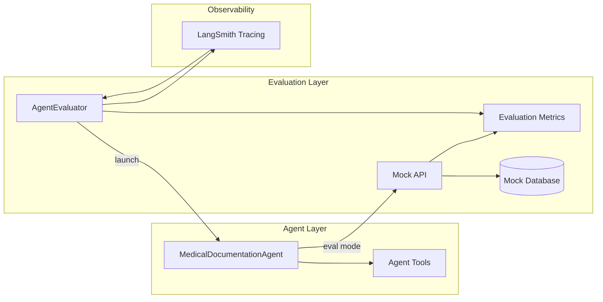
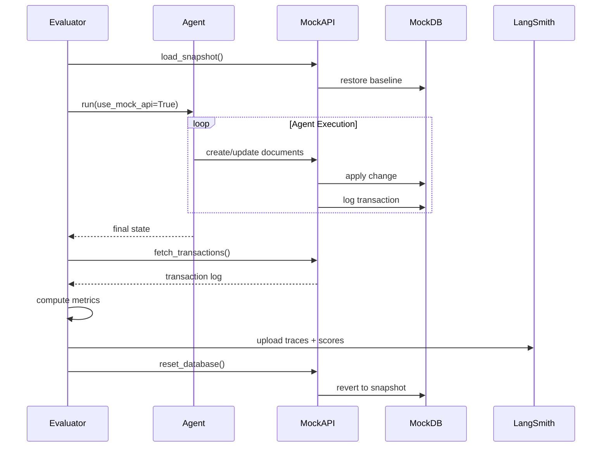

# Evaluation Layer Overview

The Evaluation Layer provides a safe, repeatable environment to measure agent performance before promoting outputs to production systems. It focuses on completeness, correctness, and safety while preserving a pristine production database.

---

## Role in the Architecture

- **Purpose**: Validate agent behavior with production-like workloads without touching live data.
- **Scope**: Covers evaluation orchestration, mock infrastructure, metric computation, and observability.
- **Integration**: Shares interfaces with the Rollback system so test and production paths stay aligned.

---

## Component Diagram

---

## Core Components

- **AgentEvaluator**
  - Spins up the agent in evaluation mode.
  - Coordinates snapshot loading, metric computation, and reporting.
  - Ensures every run starts from a known baseline.

- **Mock API & Mock Database**
  - Mirror production endpoints and schema.
  - Operate on isolated snapshots so writes never reach live systems.
  - Log every transaction for post-run analysis.

- **LangSmith Integration**
  - Captures traces, prompts, and evaluation scores.
  - Provides dashboards for regression tracking and qualitative review.

---

## Evaluation Flow

---

## Key Benefits

- **Safety**: Protects production data while exercising the full workflow.
- **Regression Detection**: Quantitative metrics highlight drift; traces support root-cause analysis.
- **Interface Parity**: Using the same APIs as production reduces drift between environments.

---

## Operational Considerations

- Refresh mock snapshots regularly so they represent current production scenarios.
- Expand evaluator suites as new document types or compliance checks are introduced.
- Monitor LangSmith dashboards; set alerts when critical scores fall below thresholds.
- Coordinate with Rollback tooling to ensure transaction formats remain consistent across environments.

---

## Summary

- The Evaluation Layer is the proving ground for agent updates.
- It combines mock infrastructure, orchestrated runs, and observability to deliver trustworthy metrics.
- Tight coupling with rollback and tooling pipelines maintains alignment with production behavior.

