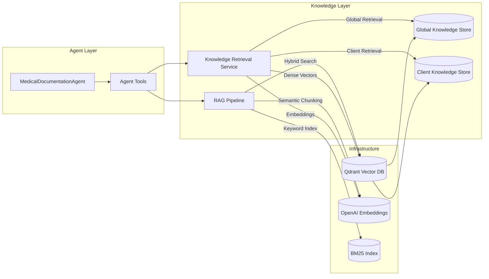
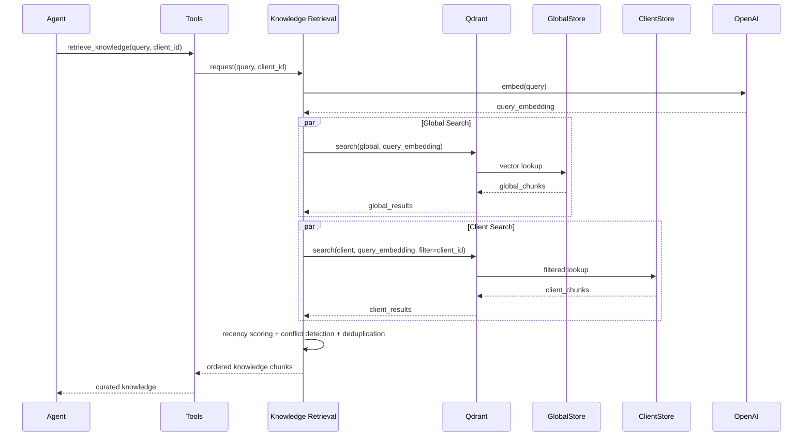

# Knowledge Layer Overview

The Knowledge Layer supplies Medical Documentation Agents with compliant, context-aware information. It merges broad regulatory intelligence with client-specific insights so generated documents remain accurate, relevant, and auditable.

---

## Role in the Architecture

- **Purpose**: Deliver high-quality knowledge that keeps documents compliant with FDA standards while reflecting each client’s nuances.
- **Scope**: Covers all retrieval logic that powers the research and drafting phases, from chunking inputs to conflict resolution.
- **Integration**: Feeds curated knowledge into the Context Manager, enabling downstream phases (creation, review) to operate on the most relevant information.

---

## Component Diagram

---

## Core Components

- **RAG Pipeline**
  - Breaks regulatory content into semantically meaningful chunks.
  - Indexes chunks with dense embeddings (OpenAI) and sparse BM25 tokens.
  - Fuses retrieval results (≈70% dense, 30% sparse) to surface similar devices quickly.

- **Knowledge Retrieval Service**
  - Bridges agent queries to dual stores for global guidance and client-specific data.
  - Filters client results via metadata, re-scores for recency, detects conflicts, and deduplicates.
  - Returns sorted knowledge chunks ready for context segmentation.

- **Qdrant Vector Database**
  - Hosts both knowledge stores with HNSW indexing and metadata filters (e.g., client IDs, document types).
  - Supports audit trails by maintaining history and provenance for retrieved chunks.

---

## Retrieval Flow

---

## Why It Matters

- **Regulatory Completeness**: Automatically surfaces relevant FDA guidance, reducing manual research.
- **Client Personalization**: Dual stores capture bespoke facts (e.g., meeting notes, timelines) so documents stay aligned with client reality.
- **Data Integrity**: Conflict detection and metadata tracking prevent mixing outdated or contradictory information.
- **Auditability**: Provenance is preserved through Qdrant transactions, supporting compliance reviews and internal audits.

---

## Interaction with Context Management

- Retrieved chunks flow into the Context Manager’s segmented buffers (regulatory, clinical, draft).
- The manager enforces a 60% usage threshold; when exceeded, it compresses segments based on the Knowledge layer’s ranking.
- Compression keeps high-importance guidance accessible while shedding lower-priority context.

---

## Operational Considerations

- **Embedding Strategy**: Monitor OpenAI model updates to maintain vector parity between new and existing chunks.
- **Conflict Heuristics**: Validate detection logic against real client data to avoid false positives/negatives.
- **Recency Bias**: Tuning recency weights helps balance historical precedent with new regulations.
- **Index Maintenance**: Periodic re-chunking and re-indexing ensure the stores reflect the latest regulatory releases and client updates.

---

## Summary

- The Knowledge Layer is the backbone of informed document generation, feeding the agent with vetted regulatory and client-specific intelligence.
- It combines semantic and lexical retrieval to deliver fast, accurate results.
- Dual stores, conflict handling, and recency scoring guarantee relevance and trustworthiness.
- Tight integration with context management keeps the working memory lean while preserving essential knowledge.

